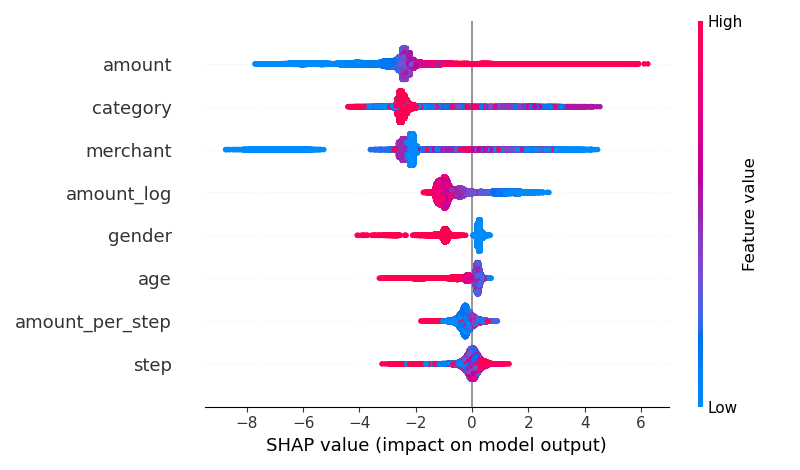

# AI-POWERED FRAUD DETECTION SYSTEM
A machine learning project for detecting fraudulent banking transactions using ensemble methods and class imbalance handling techniques.

## Data Preprocessing

### Attributes Removed
- **`zipcodeOri`**: Only 1 unique value (non-informative)
- **`zipMerchant`**: Only 1 unique value (non-informative)  
- **`customer`**: High cardinality (4112 unique values) - risk of overfitting

### Attributes Encoded
- **`age`**: Cleaned single quotes and converted to numerical values
- **`gender`**: 
  - Cleaned noise values ('E', 'U') → replaced with 'Unknown'
  - Removed single quotes from values
  - Applied manual mapping: {'F': 0, 'M': 1, 'Unknown': 2}
- **`category`**: Applied Label Encoding (15 unique categories)
- **`merchant`**: Applied Label Encoding (50 unique merchants)

### Feature Engineering
- **`amount_log`**: Natural logarithm transformation → `log(1 + amount)`
- **`amount_per_step`**: Transaction intensity → `amount / (step + 1)`

### Class Imbalance Handling
- **Original Distribution**: 98.79% non-fraud, 1.21% fraud
- **SMOTE Applied**: Balanced to 50-50 distribution (422,948 each class)
- **Undersampling Tested**: Reduced to 5,194 samples per class

## Model Performance Results

| Model | Sampling Method | Precision | Recall | F1-Score | AUC-ROC | Notes |
|-------|----------------|-----------|--------|----------|---------|-------|
| **XGBoost** | SMOTE | 0.49 | 0.93 | **0.64** | **0.9967** | Best AUC, 2.07MB, 0.043s inference |
| **Stacking (LR Meta)** | SMOTE | 0.46 | 0.94 | 0.61 | 0.9945 | XGB+RF → Logistic Regression |
| **Stacking (MLP Meta)** | SMOTE | **0.58** | 0.90 | **0.70** | 0.9948 | XGB+RF → MLP, Best F1-Score |
| **Stacking (MLP Meta)** | Undersampling | 0.26 | **0.98** | 0.41 | 0.9960 | High recall, low precision |

*Legend: LR = Logistic Regression, MLP = Multi-Layer Perceptron, XGB = XGBoost, RF = Random Forest*

## Model Justification

### XGBoost Classifier
- **Why Used**: Excellent for tabular data, handles missing values well, built-in regularization
- **Configuration**: 300 estimators, 0.05 learning rate, max depth 6
- **Best For**: Production deployment (fastest inference, smallest model size)

### Stacking Ensemble (MLP Meta-learner)
- **Why Used**: Combines strengths of multiple base learners, MLP can capture complex non-linear patterns
- **Architecture**: XGBoost + Random Forest base models → MLP meta-learner
- **Best For**: Maximum fraud detection accuracy (highest F1-score: 0.70)

### Stacking Ensemble (Logistic Regression Meta-learner)
- **Why Used**: Simple, interpretable meta-learner, faster than MLP
- **Best For**: Balance between performance and interpretability

### SMOTE vs Undersampling
- **SMOTE**: Preserves information, generates synthetic samples
- **Undersampling**: Loses majority class information, only suitable when computational resources are limited
- **Result**: SMOTE consistently outperformed undersampling across all metrics

## Key Findings
- **Best Overall Model**: SMOTE + Stacking (MLP Meta) - F1: 0.70, AUC: 0.9948
- **Class Imbalance**: SMOTE significantly better than undersampling
- **Feature Engineering**: Log transformation and ratio features improved model performance

## Business Impact
For 1M daily transactions (1.2% fraud rate):
- **XGBoost**: Detects 11,160/12,000 fraud cases, 1,260 false positives
- **MLP Stacking**: Detects 10,800/12,000 fraud cases, 849 false positives (33% fewer false positives)

## Important Images

### Data Distribution Analysis

**Figure 1:** Distribution of fraud vs non-fraud transactions showing severe class imbalance (98.79% vs 1.21%)

**Figure 2:** Gender distribution across transactions revealing data quality issues and encoding patterns

**Figure 3:** Age distribution of transaction participants showing demographic patterns

### Model Interpretability

**Figure 4:** SHAP summary plot showing feature importance and impact direction on fraud prediction. Amount and category emerge as the most influential features.

